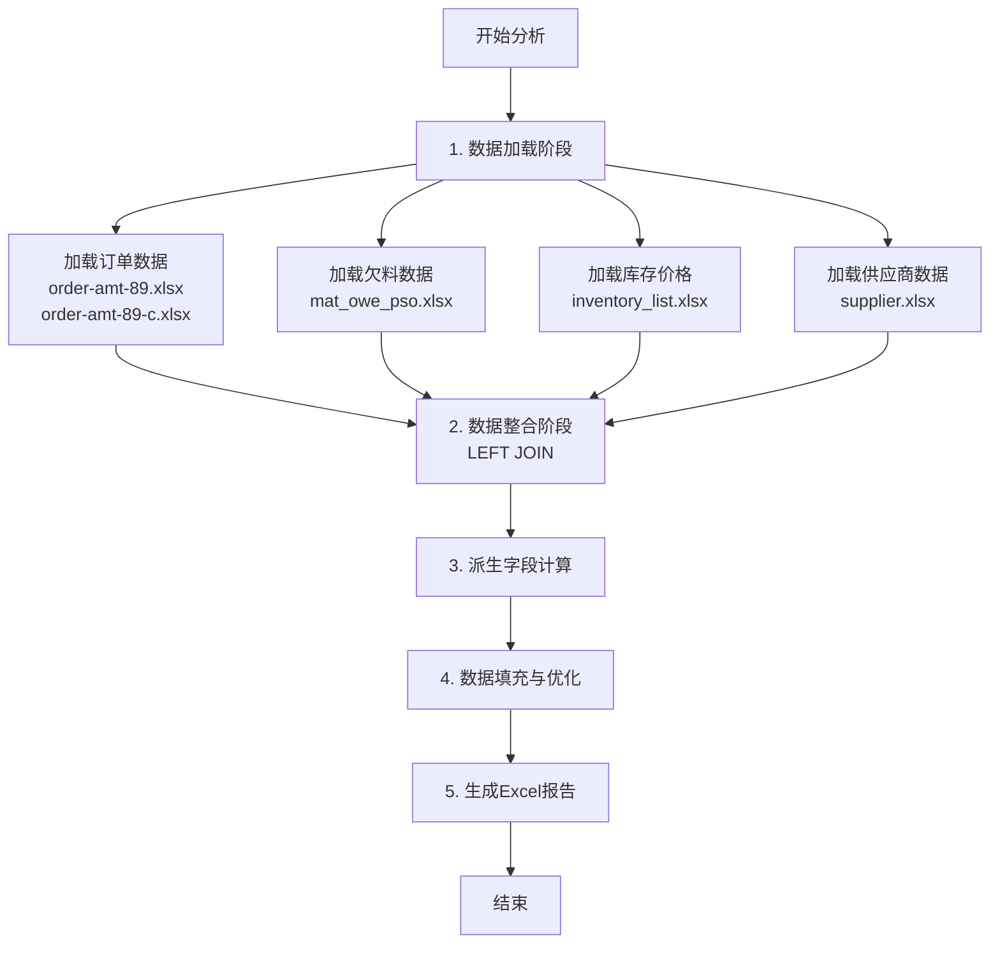

# 银图PMC综合物料分析系统工作流程

## 概述
该系统通过整合多个Excel数据源，使用LEFT JOIN架构进行综合分析，最终生成包含物料需求、供应商信息和投资回报率(ROI)的完整分析报告。

## 数据流程架构图



## 详细处理步骤

### 第一阶段：数据加载 (load_all_data)

#### 1.1 订单数据加载
**输入文件：**
- `order-amt-89.xlsx` (国内订单)
  - Sheet: '8月' → 标记为"8月-国内"
  - Sheet: '9月' → 标记为"9月-国内"
- `order-amt-89-c.xlsx` (柬埔寨订单)
  - Sheet: '8月 -柬' → 标记为"8月-柬埔寨"
  - Sheet: '9月 -柬' → 标记为"9月-柬埔寨"

**处理逻辑：**
```python
1. 分别读取4个工作表
2. 为每个工作表添加元数据：
   - 月份标记 (8月/9月)
   - 数据来源标记 (国内/柬埔寨)
3. 合并所有订单数据到一个DataFrame
4. 标准化列名映射：
   - '生 產 單 号(  廠方 )' → '生产单号'
   - '生 產 單 号(客方 )' → '客户订单号'
   - '型 號( 廠方/客方 )' → '产品型号'
   - '數 量  (Pcs)' → '数量Pcs'
   - 'BOM NO.' → 'BOM编号'
   - '客期' → '客户交期'
5. 订单金额处理：如果缺失则设置默认值1000 USD
```

#### 1.2 欠料数据加载
**输入文件：** `mat_owe_pso.xlsx`

**处理逻辑：**
```python
1. 读取Sheet1，跳过首行
2. 重命名前15列为标准字段名
3. 数据清理：
   - 删除订单编号为空的记录
   - 过滤掉物料名称包含"已齐套"或"齐套"的记录
```

#### 1.3 库存价格数据加载
**输入文件：** `inventory_list.xlsx`

**处理逻辑：**
```python
1. 读取库存数据
2. 价格优先级处理：
   - 优先使用'最新報價'
   - 如果为空则使用'成本單價'
3. 货币转换为RMB：
   - USD: 1 USD = 7.20 RMB
   - HKD: 1 HKD = 0.93 RMB
   - EUR: 1 EUR = 7.85 RMB
   - RMB: 1 RMB = 1.00 RMB
4. 生成'RMB单价'字段
```

#### 1.4 供应商数据加载
**输入文件：** `supplier.xlsx`

**处理逻辑：**
```python
1. 读取供应商数据
2. 处理供应商价格：
   - 转换'单价'为数值类型
   - 根据'币种'转换为RMB
3. 处理修改日期为datetime类型
4. 生成'供应商RMB单价'字段
```

### 第二阶段：LEFT JOIN数据整合 (comprehensive_left_join_analysis)

**核心理念：** 使用订单表作为主表，确保所有订单都出现在结果中

#### 2.1 订单 LEFT JOIN 欠料
```python
主表：订单数据 (orders_df)
左连接：欠料数据 (shortage_df)
连接键：生产单号 = 订单编号
结果：每个订单可能有多条记录（一个订单缺多种物料）
```

#### 2.2 结果 LEFT JOIN 库存价格
```python
基于：物料编号
添加字段：
- RMB单价（库存价格）
- 货币类型
- 最终价格
```

#### 2.3 结果 LEFT JOIN 供应商（最低价选择）
```python
特殊处理：
1. 对每个唯一物料编号，找出所有供应商
2. 应用最低价供应商选择算法：
   - 筛选有效价格的供应商
   - 选择RMB单价最低的供应商
3. 将选中的供应商信息映射回结果表
```

### 第三阶段：派生字段计算 (calculate_derived_fields)

#### 3.1 欠料金额计算
```python
欠料金额(RMB) = 仓存不足数量 × RMB单价
```

#### 3.2 订单金额处理
```python
1. 按客户订单号去重（避免重复计算）
2. USD转RMB：订单金额(RMB) = 订单金额(USD) × 7.20
3. 处理一对多关系：
   - 一个生产订单可能对应多个客户订单
   - 需要正确汇总所有客户订单的金额
```

#### 3.3 ROI计算（每元投入回款）
```python
按生产订单号汇总后计算：
- 如果欠料金额 > 0：ROI = 订单金额 ÷ 欠料金额
- 如果欠料金额 = 0 且有订单金额：标记为"无需投入"
- 否则：ROI = 0
```

#### 3.4 数据完整性标记
```python
判断逻辑：
- "完整"：有欠料+价格+供应商+订单金额 或 无欠料但有订单金额
- "部分"：有欠料+价格+订单金额但缺供应商
- "订单完整"：仅有订单金额
- "不缺料订单"：有生产订单但无欠料
- "订单信息不完整"：有生产订单但缺订单金额
- "无数据"：其他情况
```

### 第四阶段：数据填充与优化 (apply_conservative_filling)

#### 4.1 数据过滤
```python
过滤掉数据完整性标记为"无数据"的记录
保留所有有效的生产订单
```

#### 4.2 保守填充策略
```python
数值字段填充0：
- 数量Pcs, 欠料数量, RMB单价
- 起订数量, 供应商单价
- 工单需求, 已购未返, 手头现有
- 欠料金额, 订单金额

文本字段填充空字符串：
- 客户订单号, 产品型号
- 主供应商名称, 币种
- 请购组, 计算方式
```

#### 4.3 数据填充标记
```python
为每条记录添加填充标记：
- "原始数据"：未经填充
- "填充欠料"：欠料数量为0
- "缺失供应商"：无供应商信息
- "填充价格"：价格为0
- "无需投入"：ROI为0
```

### 第五阶段：生成Excel报告 (generate_comprehensive_report & save_comprehensive_report)

#### 5.1 字段映射与重命名
将内部字段名映射为业务友好的中文名称：
```python
生产单号 → 生产订单号
物料编号 → 欠料物料编号
物料名称 → 欠料物料名称
仓存不足 → 欠料数量
```

#### 5.2 生成多工作表Excel
**输出文件：** `银图PMC综合物料分析报告_YYYYMMDD_HHMMSS.xlsx`

**Sheet 1: 综合物料分析明细**
包含所有处理后的详细记录，字段包括：
- 订单信息：客户订单号、生产订单号、产品型号、数量、月份、来源
- 欠料信息：物料编号、物料名称、欠料数量、欠料金额
- 供应商信息：供应商名称、供应商号、单价、币种、起订量
- 财务指标：订单金额(USD/RMB)、每元投入回款
- 数据标记：完整性标记、填充标记、计算方式

**Sheet 2: 汇总统计**
关键业务指标：
- 总订单数
- 有欠料订单数
- 精确匹配记录数
- 完整数据记录数
- 涉及供应商数
- 总欠料金额(RMB)
- 总订单金额(RMB)
- 平均投入产出比
- 数据处理统计

## 数据质量保证机制

### 1. 数据验证
- 订单号存在性检查（如PSO2501724追踪）
- 数值字段类型转换与异常处理
- 空值和异常值的安全处理

### 2. 关联完整性
- LEFT JOIN确保所有订单保留
- 一对多关系正确处理（生产订单→客户订单）
- 物料→供应商的最优选择

### 3. 计算准确性
- 货币转换统一标准
- ROI计算的特殊情况处理
- 去重逻辑避免金额重复计算

## 性能优化措施

1. **批处理进度显示**
   - 每处理100个物料显示一次进度
   
2. **内存优化**
   - 使用向量化运算替代循环
   - 及时释放不需要的DataFrame
   
3. **缓存策略**
   - 供应商映射使用字典缓存
   - 避免重复计算

## 异常处理

所有阶段都包含try-except异常捕获：
- 文件不存在：提供明确错误信息
- 数据格式错误：使用默认值填充
- 计算错误：返回0或空值
- 保存失败：显示详细错误信息

## 输出结果说明

最终生成的Excel报告支持：
- 按月份筛选分析
- 按ROI阈值筛选高价值订单
- 按供应商分组查看采购建议
- 数据完整性审计追踪
- 投资回报率优化决策

该报告为PMC部门提供：
1. 精确的物料需求预测
2. 最优供应商选择建议
3. 投资回报率分析
4. 紧急采购清单
5. 数据质量评估